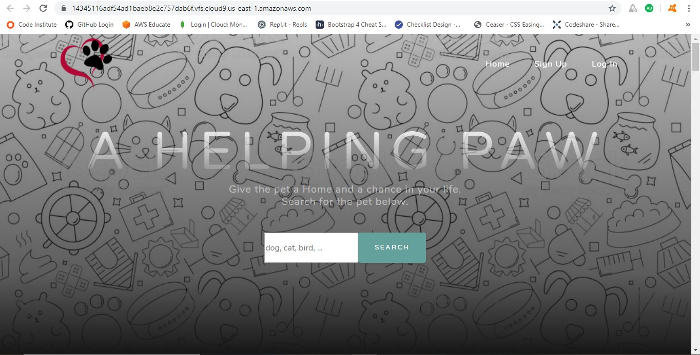
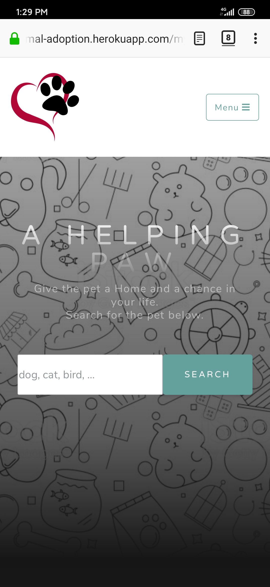

# A Helping Paw
This project focuses on creating a classified advertisement site for Pet Adoption. 

Pets are abandoned every day. In 2011, there were 7,081 animals– up to 50 per cent were unwanted or abandoned pets. 3,169 were domestic pets like dogs, cats, rabbits, hamsters and guinea pigs often abandoned at void decks. Many animals are left at shelter homes. Many shelter homes unable to cope with the increased number of incoming animals, due to a lack of space and limited financial resources.

A Helping Paw was established in 2017 with a mission to help these poor animals to find a new Home. We strongly believe these animals deserve a second chance at life. 

We provide an advertisement space for both Shelter Homes and Pet Owner to post profile of the animals.

User who are interested to adopt a Pet are welcome to search through the listed advertisements and contact the relevant organizations or personnel. 

Details like Pet name, Pet Category, Gender, Age, Color and Description, Person to Contact and Contact Information will be displayed in individual search result.

The website is deployed in Heroku with the link below:<br>
https://nyt-animal-adoption.herokuapp.com

## UX Design - User Stories
### User View - Shelter Homes, Pet Owner and User who wish to adopt the animals
1) User would like to find out more about the website and things to note for pet adoption.
2) User would like to search for pet easily by keying in the type of pet that are looking for.
3) User will like to see pet details, such as Age, Gender, Color, Description, etc. 
4) User would like to have the contact information of Shelter Homes and Pet ex-owner so that user can liaise with them for pet adoption.
5) User (Shelter Homes and Pet Owner) would like to post online advertisement of available Pet so that the Pet can find a new Home. 
6) User (Shelter Homes and Pet Owner) would like to view, edit and update the advertisement that they posted. 
7) User (Shelter Homes and Pet Owner) would like to delete the advertisement after the Pet found a new Home.

### Organization Goals (A Helping Paw)
1) Organization would like to create a classified advertisement website to help the aborted Pet find a new Home.
2) Organization would like to spread the idea of adopting an animal instead of buying new ones to the general public. Benefits and things to note for adoption will be posted on the homepage.
3) Organization would like to display the contact information of Shelter Home and Pet Owner so that user can approach them directly for pet adoption. 
4) Organization would like allow the Shelter Home and Pet Owner to manage their advertisement. They will be able to view, edit and delete existing advertisement as well as posting new advertisement.

## Project Structure

### Wire Frame

The wireframe can be viewed in the link below:<br>

https://drive.google.com/open?id=1v463MvTvPzKZSj44pPbHvT5X4nMv5XQm

### ER Diagram


When the user sign up for an account, _id will be auto-generated in the user collection.

When the user create a pet advertisement,  the _id in the user collection will be store in the user_id of the pet collection. 

The Search is based on the petCat in pet collection. The user_id in the pet collection is used to link to _id in the user collection. If both of them matches, the user will be display in the search result with the pet details.

The edit and delete function of the pet is based on the _id of the pet collection. <br>


## Project Skeleton

### Features

 | Page | Description |
 |--- | --- |
 | Top Navigation Bar | The top nagvigation bar has the following items: <br> 1. Organization Logo - direct to the homepage when user click on it. <br> 2. Home Link- direct to homepage when clcked. <br>  3. Signup Link - direct to Sign Up Page when clicked. <br> 4. Log In Link - direct to Log In Page when clicked. <br><br> |
 | Footer Bar | The footer bar has the following items: <br> 1. Address <br> 2. Email <br> 3. Phone Number <br> 4. Social Media Link  <br><br> |
 | Homepage | The homepage has a big organization name with slogan. There is a text box for user key in and search for the pet to adopt. <br><br> 3 main informations are also displayed on the Home page. <br> 1. About Us - This give user on the background of the organizations. <br> 2. 4 Reasons to Adopt a Pet Than Buy One -  This educate user on the benefit of adopting a pet than buying them from store. <br> 3. Things to Think About Before You Decide to Adopt - This prepare user on the consideration factor before any pet adoption. <br><br>|
 | Search Result Page | This shows the search result of the user input. <br><br> The following details are shown in individual advertisement: <br> 1. Pet Name <br> 2. Category <br> 3. Gender <br> 4. Color <br> 5. Age <br> 6. Description <br> 7. Contact Person Name <br> 8. Contact Number <br> 9. Email Address <br><br> No search result will be displayed if the search pet is not available. <br><br>|
 | Sign Up Page | This is the sign up page for new user. User can only post an advertisement after they sign up an account. <br><br> They need to provide the user name, email address and contact number to sign up account. The user name has to be unique and cannot match any existing username. Warning message will be shown if there is an exisiting username. <br><br> |
 | Login Page | This page allows the user to login their account. User need to login into their account to add and manage their advertisements. They will log in by entering only their username. <br><br> The simple login system is achieved by directing in between webpage with no session involved. As the website does not deal with any payment, complicated login system is not required. <br><br> |
 | My Login Page | This page displays the information of the user. They are able to amend and update their particular. Message will be prompt when their particular is updated successfully. <br> 3 other buttons are: <br> 1. My Advertisement - to view user advertisement. <br> 2. Add Advertisement - to add new advertisement <br> 3. Logout - Logout and go back to Homepage <br><br> |
 | My Advertisement Page | This page shows the advertisement posted by the user. They can amend and update their advertisement. They can also delete their advertisement. Message will be prompt when their particular is updated or deleted successfully. <br><br> |
 | Add Advertisement Page | This page allows the user to add new advertisement. They need to input the following details: <br> 1. Pet Name <br> 2. Category <br> 3. Gender <br> 4. Color <br> 5. Age <br> 6. Description <br><br> |
 | Delete Page | This page prompt the user to confirm if they wanted to delete the advertisement. Advertisement will be removed upon confirmation. <br><br> |
 

### Features to implement in the future
I wish to add additional feature for the Shelter Home and Pet Owner to upload picture of the Pet so that it can attract more users to view the advertisement. 

I wish to explore more on Flask session which is not covered in the syllabus and use it for more secure and smoother login system.

## Project Surface
The theme that I wished to present is cool and user-friendly website.
The Design and CSS of the webpage is created using Bootstrap Starter Template, <a href = "https://startbootstrap.com/themes/grayscale/">Grayscale.</a><br>

### Colours
* White, Grey and Black are main colors chosen for the website. 
* White - The White background give the website a clean and pure look. 
* Black - The Black cute animal cartoon in the background match the theme of the Pet adoption. It lightens the mood of the website in this serious topic. The black color also brings out the cool theme. 
* Grey - The Grey color in the background balance and neutralize the contrast between the White and Black color.

### Logo
The logo of the website is a Dog Paw enclosed in a Red Heart shape. 

The Dog Paw fit the title of the website, A Helping Paw. We offer A Helping Hand in providing an advertising space for the Pet to find a new Home. In return, the Pet offer A Helping Paw in our life, by contributing their love to our life. 

The Heart Shape enclosing the Paw represents the Love we have for our Pets and our protection (Home) towards them.

### Technologies Used
● <a href = "https://aws.amazon.com/cloud9/"> **Cloud9** </a> - The project was developed using Cloud9 Integrated Development Environment. <br>
● **HTML** - The project uses HTML to create the pages. <br>
● **CSS** - The project uses CSS to style the pages. <br>
● <a href="https://getbootstrap.com/">**Bootstrap**</a> - The project uses Bootstrap for styling and responsive design. <br>
● <a href="https://fonts.google.com/">**Google Fonts**</a> - The project uses Google Fonts to style the Fonts. <br>
● **JavaScript** - The project uses JavaScript for responsiveness. <br>
● <a href="https://flask.palletsprojects.com/en/1.1.x/">**Flask**</a> - The project uses Flask with Python to build web applications. <br>
● <a href="https://www.mongodb.com/">**MongoBD**</a> - The project uses MongoBD to store and process the data. <br>
● <a href="https://github.com/">**GitHub**</a> - The project uses GitHub as it's version control system. <br>
● <a href="https://id.heroku.com/login">**Heroku**</a> - The project uses the Heroku platform for hosting the website. <br><br>

## Testing

### Manual Testing

Login Account<br>
***```Username: Test```***

| Test Case(s) | Test Description | Result |
| --- | --- | --- |
| --- | Homepage | --- |
| 1 | From the Home Page, all images and words must be as per wireframe design. There should not be any overlap of any images or wording. <br><br>| Pass | 
| 2 | I clicked on Home page, Login and Sign Up link in the navigation bar. It should bring you the respective web page. <br><br>| Pass <br>|
| 3 | From the Homepage, enter the animal to be search ```(for example. dog, cat, bird, hamster or rabbit)``` and click the Search Button. All advertisements with search keyword in petCat will be display in the Search Result Page. <br><br> Details such Pet Name, Age, Color, Pet Category, Description, Name of Contact Person, Contact Number and Email are shown. <br><br>| Pass |
| --- | Search Result Page | --- |
| 4 | From the search Result Page, enter another animal to be search ```(for example. dog, cat, bird, hamster or rabbit)``` and click the Search Button. All advertisements with search keyword in petCat will be display in the Search Result Page. <br><br> | Pass |
| 5 | I entered an animal not available in the database ```(for example. dinosaur, dragon or alien)```. No search result message will be shown. <br><br>| Pass |
| --- | Sign Up Page | --- |
| 6 | From the Sign Up Page, click on the link for existing user below the Sign Up Button. It will be directed to the Login Page for existing user to login. <br><br>| Pass |
| 7 | I tried to sign up account with an existing user name ```(for example. Test, Charlotte, Johnny, Paul, Jimmy or Linda)```. <br><br> User will be prompt to sign up with a diiferent user name as there is an existing user. <br><br> The account will not be created. <br><br>| Pass |
| 8 | I tried to sign up account while leaving the boxes empty. There will be an error message prompting you to enter the required information. Error message will also be prompt if email format is not correctly entered. <br><br>| Pass |
| 9 | I entered a new User Name, Email and Contact Number and click on the Sign Up Button. New Account will be created. <br><br>  It will direct to My Login page which shown my User Name, Email Address and Contact Number. <br><br>| Pass |
| --- | Log In Page | --- |
| 10 | From the Login Page, click on the link to sign up below the Log In Button. It will be directed to the Sign Up Page for new user to sign up an account. <br><br>| Pass |
| 11 | I entered an invalid user name and click Login Button. ```(for example, Tarzan or Tonny)``` Error message will be prompt with Invalid User Name and ask user to sign in with valid user name. <br><br> | Pass |
| 12 | I entered a valid user name and click Login Button. ```(for example. Charlotte, Johnny, Paul, Jimmy or Linda)```. The user will be able to login and direct to My Login Page. The user name, email and contact will be displayed. The Log In Link will be replaced with Log Out Link. Sign Up will not be shown. <br><br> | Pass |
| --- | My Login Page | --- |
| 13 | From My Login Page, I changed the contact number and email address and click Update Details Button. The user contact number and email address are updated. Message "Details update successfully" will be shown. <br><br>| Pass  <br>|
| 14 | I clicked on My Advertisement Button. It will direct to My Advertisement Page. Error message "You do not have any existing Advertisment. Please click Add Advertisment or Back to My Login Button." will be prompt as the new user do not have any existing Advertisement <br><br>| Pass |
| 15 | I clicked on Add Advertisement Button. It directs me to Add Advertisement Page. <br><br> | Pass |
| --- | Add Advertisement Page | --- |
| 16 | From Add Advertisement Page, I clicked on the Cancel Button. It will direct to My Login Page. <br><br> | Pass |
| 17 | From My Login Page, I clicked on Add Advertisement Button. It will direct to Add Advertisement Page. <br><br> | Pass |
| 18 | From Add Advertisement Page, I leave the boxes empty and click Add Advertisement Button. Error message will prompt the user to enter the required information. <br><br>| Pass  <br> |
| 19 | From Add Advertisement Page, I entered all the pet details and click Add Advertisement Button. Advertisement will be added with a success message "Advertisement Added Successfully" prompt. It will be directed to My Advertisement Page with all Pet Information displayed. <br><br> | Pass |
| --- | My Advertisement Page | --- |
| 20 | From My Advertisement Page, I changed the pet details and clicked Update Advertisement Button. The pet details were updated and success message "Advertisement Update Successfully" prompt. <br><br> | Pass |
| 21 | From My Advertisement Page, I clicked on Delete Advertisement. It will direct to Delete Advertisement Page. <br><br> | Pass |
| --- | Delete Advertisement Page | --- |
| 22 | From Delete Advertisement Page, I clicked the No Button. It will direct back to My Advertisement Page. That advertisement will not be deleted. <br><br> | Pass |
| 23 | From Delete Advertisement Page, I clicked Confirm Delete Button. The advertisement will be deleted. It will direct back to My Login Page. <br><br> | Pass |
| --- | My Login Page | --- |
| 24 | From My Login Page, I clicked on Log Out Button. It directs me to Homepage. <br><br> | Pass |


#### Responsiveness
The websites are tested on mobile phone and desktop. In addition, the pages are tested using different viewport under the inspector tool. The site is fully responsive - it's mobile and desktop-friendly.
 
#### Website Desktop View


#### Website Mobile View


#### Browser Compatibility
The application was tested on Firefox and Google Chrome. Both pages functioned satisfactorily on both browsers.

#### Problems Encountered/Bugs solved
* I was unable to edit the advertisement in the first place. After going through similar problems in Stackoverflow, I realized I forget to put in condition for Mongodb to refer to for the collection to be amended.

* I was unable to display the whole sentence in the description. Under the guidance from the lecturer, I realized that I need to put my description in double quote so that it will be displayed in string format. 

## Upload Files to Github
This project was written using AWS Cloud IDE, uploaded to Github for version control. 
1) At the start of the project, I created my first Index.html file in Cloud9.
2) Next, I opened a new terminal and type in the ```git init``` command to initialize a local repository.
3) A new remote repository was created with a name A Helping Paw.
4) After creating the repository in GitHub, I copy the code given back in Cloud9 to link the local repository to the remote one.
5) Under the new terminal in Cloud9, the Index.html is added using the git add command.
6) I typed in the command ```git commit -m “Initial commit”```, which puts the file into the staging area for the first commit.
7) Next, I used the ```git push``` command to send the file to the remote repository.
8) The terminal will prompt for the username and password.
9) The command git add, git commit -m “message” and git push are used to saved the rest of the files and pictures to the remote repository.
10) I tried to push the code regularly to Github every time there is any updates to the files. It served as a backup as I know I can go back to my history to retrieve my earlier codes if I messed up my current codes in Cloud9.

## Deployed Webpage to Heroku
The website has been deployed to Heroku with reference to our lecturer, Mr Paul Chor’s notes. <br>

1) After creating a git repository, I installed Heroku using bash. 
2) I logged into Heroku in bash. 
3) A new app with a name of nyt-animal-adoption was created. 
4) New remotes are added and Gunicorn is installed. 
5) I created a file named "Procfile". 
6) The file Procfile was opened in the editor to add the following command and save<br>
    web gunicorn app:app
7) I created a requirements file called  requiremnts.txt
8) All files were added, commit and push to the files to Heroku.
9) After the deployment, I can access the website via the Url in my Heroku account. 

## Credits
* Some of the advertisements details and static figures are extracted from the local Shelter Home, <a href='http://www.spca.org.sg/'>SPCA</a>
* The notes on Things to Consider before Adoption is extracted from local Shelter Home, <a href='https://sosd.org.sg/adopt-a-dog'>SOSD</a>
* The photos of the animals was obtained from a stock image library called <a href ='https://www.pexels.co'>Pexels</a>
* The collapse feature of the Important Notes in the Homepage is coded with reference to <a href = 'https://getbootstrap.com/docs/4.0/components/collapse/'>Bootstrap</a>.
* The Logo is taken from <a href ='https://www.123rf.com'>123RF</a>
* The background image is taken from <a href ='https://www.freepik.com'> Freepik </a>
* The problems are resolved with reference to similar problems faced by other programmer in <a href = 'https://stackoverflow.com/'>Stackoverflow</a> as well as advice from lecturers.
* The styling and features were made with reference to the tutorial from <a href='https://www.w3schools.com'>W3schools</a>.
* The simple login feature is heavily modified from <a href = "https://github.com/PrettyPrinted/mongodb-user-login">PrettyPrinted Github Code</a>
* The Design and CSS is modified from Bootstrap Starter Template, <a href = "https://startbootstrap.com/themes/grayscale/">Grayscale.</a>