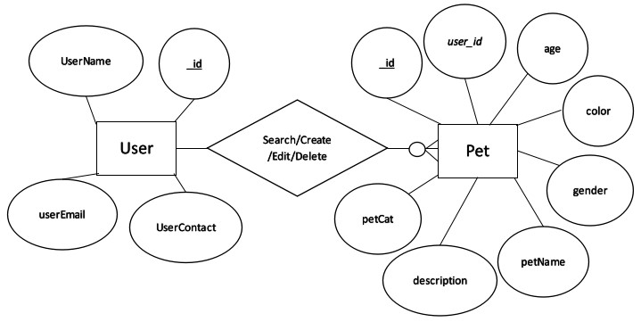
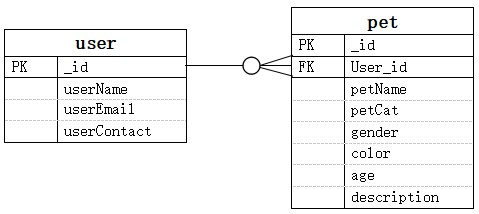
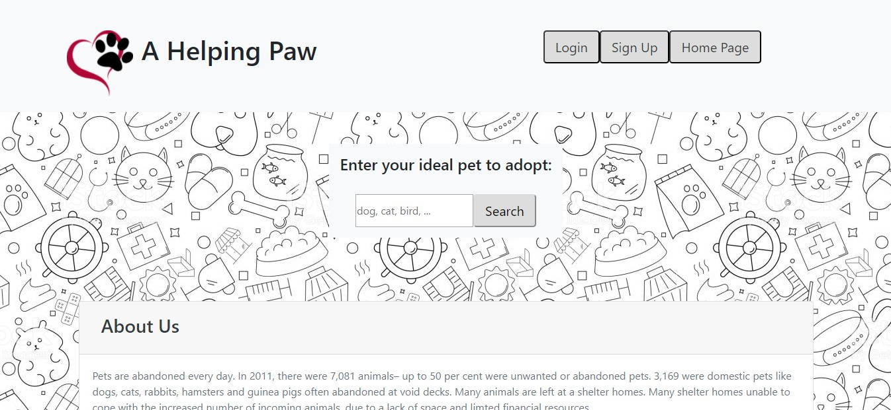
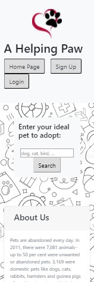

# A Helping Paw
This project focuses on creating a classified advertisement site for Pet Adoption. 

Pets are abandoned every day. In 2011, there were 7,081 animals– up to 50 per cent were unwanted or abandoned pets. 3,169 were domestic pets like dogs, cats, rabbits, hamsters and guinea pigs often abandoned at void decks. Many animals are left at shelter homes. Many shelter homes unable to cope with the increased number of incoming animals, due to a lack of space and limited financial resources.

A Helping Paw was established in 2017 with a mission to help these poor animals to find a new Home. We strongly believe these animals deserve a second chance at life. 

We provide an advertisement space for both Shelter Homes and Pet Owner to post profile of the animals.

User who are interested to adopt a Pet are welcome to search through the listed advertisements and contact the relevant organizations or personnel. 

Details like Pet name, Pet Category, Gender, Age, Color and Description, Person to Contact and Contact Information will be displayed in individual search result.

The website is deployed in Heroku with the link below:
https://nyt-animal-adoption.herokuapp.com

## Project Strategy
### UX - User Stories
1) User Stories (Shelter Homes, Pet Owner and user who wish to adopt the animals)
2) User would like to find out more about the website and things to note for pet adoption.
3) User would like to search for the pet easily by keying in the type of pet that are looking for.
4) User will like to see pet details, such as Age, Gender, Color, Description, etc. 
5) User would like to have the contact information of Shelter Homes and Pet ex-owner so that user can liaise with them for pet adoption.
6) User (Shelter Homes and Pet Owner) would like to post online advertisement of available Pet so that the Pet can find a new Home. 
7) User (Shelter Homes and Pet Owner) would like to view, edit and update the advertisement that they posted. 
8) User (Shelter Homes and Pet Owner) would like to delete the advertisement after the Pet found a new Home.

### Organization Goals (A Helping Paw)
1) A Helping Paw wants to create a classified advertisement website to help the aborted Pet find a new Home. As such, the following organization goals have been identified:
2) Organization would like to spread the idea of adopting an animal instead of buying new ones to the general public. Benefits and things to note for adoption will be posted on the homepage.
3) Organization would like to allow the user to search through posted advertisements easily for the pets they are looking for.
4) Organization would like to display the contact information of Shelter Home and Pet Owner so that user can approach them directly for pet adoption. 
5) Organization would like allow the Shelter Home and Pet Owner to manage their advertisement. They will be able to view, edit and delete existing advertisement as well as posting new advertisement.

## Project Scope
Based on the user stories and organizational goals identified, these are the following features the menu is going to implement:

### Pages/Features
1) In the homepage, general information such as Introduction of the Organization, Benefit of Adopting Pet and Things to Note for Pet Adoption can be found.
2) User will able to search for their Pet based on Pet Category. Animal details such as age, gender, color and description will be displayed. Contact information of Shelter Home and Pet Owner will be displayed in each advertisement too. User can approached them directly through the contact information.
3) There will be a Sign Up Page for Shelter Home and Pet Owner to register an account. After they register their account, they will be able to access it via user name in the Login Page.

4) After logging into their account, they will be able to:  
    a) post new advertisements.  
    b) view all the advertisement that they posted.  
    c) edit their advertisement.  
    d) delete their advertisement.  

## Project Structure
### Wire Frame
The wireframe can be viewed in the link below:

### ER Diagram

When the user sign up for an account, _id will be auto-generated in the user collection.

When the user create a pet advertisement,  the _id in the user collection will be store in the user_id of the pet collection. 

The Search is based on the petCat in pet collection. The user_id in the pet collection is used to link to _id in the user collection. If both of them matches, the user will be display in the search result with the pet details.

The edit and delete function of the pet is based on the _id of the pet collection.  

## Project Skeleton
### Existing Features
Layout of the homepage is kept simple and user friendly. Important information will standout due to the plain layout. 3 main informations are displayed on the Home page.
1) About Us - This give user on the background of the website.
2) 4 Reasons to Adopt a Pet Than Buy One -  This educate user on the benefit of adopting a pet than buying them from store.
3) Things to Think About Before You Decide to Adopt - This prepare user on the consideration factor before any pet adoption. 

In the homepage, users are able to search for the pet that they wish to adopt.There is a text box for customers to enter the type of pet that they wish to adopt. The search button will trigger the search and list out all the pets that match that Pet Category. The following details such as Pet Name, Category, Gender, Color, Age and Description  will be displayed in Search Result. The contact person and contact information such as email and number in another collection will also be displayed. The 2 collections in MongoDB are linked by User ID. 

Shelter Home and Pet Owners need to create an account before they can post any advertisement. In the Sign Up page, they need to provide the user name, email address and contact number to create the account.

In the Login page, account holder need to enter their user name to log into their account. When account holder click the Login Button, contact information linking to the user name will be displayed. The account holder is able to edit their contact details and update by clicking on Update My Details Button. 

When the account holder clicks on Add Advertisement Button, they will be directed to New Advertisement Page. They are able to post advertisement of the Pet that needs a new Home. They need to provide Pet Name, Category, Gender, Color, Age and Description of the animals when posting the advertisement.

The account holder is able to view all the advertisements that they posted online when they click on the My Advertisement Button.

In  My Advertisement Page, the account holder is able to edit and delete the advertisement.

### Features to implement in the future
I wish to add additional feature for the Shelter Home and Pet Owner to upload picture of the Pet so that it can attract more users to view the advertisement. 

## Project Surface
The theme that I wished to present is simple and user-friendly website.

### Colours
* White, Grey and Black are main colors chosen for the website. 
* White - The White background give the website a clean and pure look. 
* Black - The Black cute animal cartoon in the background match the theme of the Pet adoption. It lightens the mood of the website in this serious topic. 
* Grey - The Grey color in the navigation bar and button balance and neutralize the contrast between the White and Black color.

### Logo
The logo of the website is a Dog Paw enclosed in a Red Heart shape. 

The Dog Paw fit the title of the website, A Helping Paw. We offer A Helping Hand in providing an advertising space for the Pet to find a new Home. In return, the Pet offer A Helping Paw in our life, by contributing their love to our life. 

The Heart Shape enclosing the Paw represents the Love we have for our Pets and our protection (Home) towards them.

### Technologies Used
* HTML4.0, Python and CSS3 were the main language used in this project.
* Bootstrap was used to make the website mobile responsive.
* Cloud9 was used as the IDE for building the website.
* Repository was hosted on GitHub.
* All databases are store in MongoDB
* The website are deployed in Heroku.

### Testing

#### Responsiveness
The websites are tested on mobile phone and desktop. In addition, the pages are tested using different viewport under the inspector tool. The site is fully responsive - it's mobile and desktop-friendly.
 
#### Website Desktop View

#### Website Mobile View

#### Browser Compatibility
The application was tested on Firefox and Google Chrome. Both pages functioned satisfactorily on both browsers.

| Test Case(s) | Test Description | Outcome | Result |
| --- | --- | --- | --- |
| 1 | Access the Homepage.   Click on About Us, 4 Reasons to Adopt a Pet Than Buy One, Things to Think About Before You Decide to Adopt individually.    The tab should expand and display the details. The other two tabs should collapse when one tab is expand. | Each tab expand and collapse as per the requirement. | Pass |
| 2 | Click on Home page, Login and Sign Up Button in the navigation bar. It should bring you the respective web page. | All buttons function as per requirement. The buttons direct to the correct webpage. | Pass |
| 3 | In the Homepage, enter the animal to be search ( for example. dog or cat) and click the Search Button. All advertisements with dog in petCat will be display.    Details such Pet Name, Age, Color, Pet Category, Description, Contact Person, Contact Number and Email should be properly displayed. | The search results display as per the search keyword.    Details such Pet Name, Age, Color, Pet Category, Description, Contact Person, Contact Number and Email are properly displayed. | Pass |
| 4 | In the Sign Up Page, enter the User Name, Email and Contact Number and click on the Sign Up Button. New Account will be created.    Try to click on the Search while leaving the boxes empty. There will be an error message prompting you to enter the required information. Error message will also be prompt if email is not correctly entered. | The User Account is created when user click the Sign up Button. This can be verified when user login with the registered User Name.    Error message is prompted when the boxes are empty and email not correctly entered | Pass |
| 5 | In the Login Page, when the user enter the user name and click the Login Button. (for example, Johnny or Jane) The user name, email and contact will be displayed.    Change the contact number and click on Update My Details Button. The user contact is updated. | Correct user details are displayed when user entered their user name and clicked the Login Button.   The user is able to update the contact number and other information. The changes are observed when the user login again. | Pass |
| 6 | After logging in, click on My Advertisement Button. All the advertisement posted by the user should be displayed. | All the advertisements posted by the user are displayed. | Pass |
| 7 | After logging in, click on Add Advertisement Button. The web page will be directed to the Add Advertisement page.    Enter the details and click on the Add Advertisement Button. New Advertisement should be added.    Leave the boxes empty and click the Add Advertisement Button. Error message will prompt the user to enter the required information. | The web page are directed to Add Advertisement page.    New Advertisement are added. The new advertisement are display when user clicked on My Advertisement Button.    Error message are shown when the boxes are left empty. | Pass |
| 8 | In My Advertisement page, change details such as the Pet Name and click on Update Advertisement Button.    The advertisement should be updated. | The advertisement is updated. Changes are verified when user clicked on My Advertisement Button to view their advertisement. | Pass |
| 9 | In My Advertisement page, click on the Delete Button to delete the advertisement.    The advertisement should be deleted. | The advertisement is deleted.    The deleted advertisement is not shown when user clicked on My Advertisement Button. | Pass |
| 10 | The website is tested for responsive with mobile, desktop and with different browser.    The layout in desktop and mobile view should match the Wire diagram. | The website is mobile responsive with mobile, desktop and with different browser.    The layout in desktop and mobile view match the Wire diagram. The animal picture in Sign Up and Login pages are not shown as per wire frame. | Pass |

#### Problems Encountered/Bugs solved
* I was unable to edit the advertisement in the first place. After going through similar problems in Stackoverflow, I realized I forget to put in condition for Mongodb to refer to for the collection to be amended.

* I was unable to display the whole sentence in the description. Under the guidance from the lecturer, I realized that I need to put my description in double quote so that it will be displayed in string format. 

### Upload Files to Github
This project was written using AWS Cloud IDE, uploaded to Github for version control. 
1) At the start of the project, I created my first Index.html file in Cloud9.
2) Next, I opened a new terminal and type in the git init command to initialize a local repository.
3) A new remote repository was created with a name A Helping Paw.
4) After creating the repository in GitHub, I copy the code given back in Cloud9 to link the local repository to the remote one.
5) Under the new terminal in Cloud9, the Index.html is added using the git add command.
6) I typed in the command git commit -m “Initial commit”, which puts the file into the staging area for the first commit.
7) Next, I used the git push command to send the file to the remote repository.
8) The terminal will prompt for the username and password.
9) The command git add, git commit -m “message” and git push are used to saved the rest of the files and pictures to the remote repository.
10) I tried to push the code regularly to Github every time there is any updates to the files. It served as a backup as I know I can go back to my history to retrieve my earlier codes if I messed up my current codes in Cloud9.

### Deployed Webpage to Heroku
This project was deployed to Heroku.
1) After creating a git repository, I installed Heroku using bash. 
2) I logged into Heroku in bash. 
3) A new app with a name of nyt-animal-adoption was created. 
4) New remotes are added and Gunicorn is installed. 
5) I created a file named "Procfile". 
6) The file Procfile was opened in the editor to add the following command and save 
    web gunicorn app:app
7) I created a requirements file called  requiremnts.txt
8) All files were added, commit and push to the files to Heroku.
9) After the deployment, I can access the website via the Url in my Heroku account. 

### Credits
* Some of the advertisements details and static figures are extracted from the local Shelter Home, <a href='http://www.spca.org.sg/'>SPCA</a>
* The notes on Things to Consider before Adoption is extracted from local Shelter Home, <a href='https://sosd.org.sg/adopt-a-dog'>SOSD</a>
* The photos of the animals was obtained from a stock image library called <a href ='https://www.pexels.co'>Pexels</a>
* The collapse feature of the Important Notes in the Homepage is coded with reference to <a href = 'https://getbootstrap.com/docs/4.0/components/collapse/'>Bootstrap</a>.
* The Logo is taken from <a href ='https://www.123rf.com'>123RF</a>
* The background image is taken from <a href ='https://www.freepik.com'> Freepik </a>
* The problems are resolved with reference to similar problems faced by other programmer in <a href = 'https://stackoverflow.com/'>Stackoverflow</a> as well as advice from lecturers.
* The styling and features were made with reference to the tutorial from <a href='https://www.w3schools.com'>W3schools</a>.
